# ARCHITECTURE — Purple Range (codename Phalanx)

> Status: draft
> Last updated: 2026-05-30
> Tier: large
> PRD: [`docs/PRD.md`](PRD.md) · Spine: [`docs/BRAINSTORM.md`](BRAINSTORM.md) · ADR: [`docs/ADR/0001-manifest-oracle-event-sourced-scoring.md`](ADR/0001-manifest-oracle-event-sourced-scoring.md) · Open questions: [`docs/OPEN-QUESTIONS.md`](OPEN-QUESTIONS.md) · Red-team: [`docs/RED-TEAM.md`](RED-TEAM.md) · TODO: [`docs/TODO.md`](TODO.md)

## High-level view

Purple Range is a single-host, sequentially-scoped purple-team training lab. A
**scenario generator** stands up a (possibly randomized) victim and emits a
versioned **`vuln_manifest`** — the *oracle* that travels with the target,
declaring the vulns present and the expected attack TTPs, detections, and
mitigations. **Automated threat actors** (bounded to an allowlisted technique
set) execute attacks and record **observed-outcome ground-truth**. The
**scorer** grades all three pillars — ATTACK, DETECT, MITIGATE — against the
manifest and ground-truth, *never* against hardcoded answers, and writes every
fact to an **append-only, hash-chained event log** (SQLite); the scoreboard is a
fold over that log. Every external dependency — hypervisor, SIEM, scenario
generator, vendor attack tools, isolation/firewall, clock, randomness — sits
behind a **port** with a production adapter and a test fake. A separate
**isolation layer** enforces network containment as fail-closed code, with a
**host-side continuous egress tripwire as the primary gate** (ADR-0006), before
and *throughout* every attack run.

```mermaid
graph TD
  CLI["lab CLI / phalanx scorer CLI"] --> ORCH["orchestrator (core, pure)"]

  ORCH --> P_LAB{{Port: LabProvider}}
  ORCH --> P_GEN{{Port: ScenarioGenerator}}
  ORCH --> P_ACT{{Port: ThreatActor}}
  ORCH --> P_TEL{{Port: Telemetry}}
  ORCH --> P_SCO["Scorer (core, pure)"]
  ORCH --> P_ISO{{Port: IsolationProvider}}
  ORCH --> P_CLK{{Port: Clock}}
  ORCH --> P_RNG{{Port: Rng}}

  P_LAB --> A_VBOX["adapter: VagrantVirtualBox (prod, now)"]
  P_LAB --> A_LIBV["adapter: Libvirt (deferred)"]
  P_LAB --> A_DKR["adapter: DockerCompose (web/Vulhub/Kali)"]
  P_LAB --> F_LAB["fake: InMemoryLab"]

  P_GEN --> A_VULHUB["adapter: VulhubCVE (prod, fast-path)"]
  P_GEN --> A_SECGEN["adapter: SecGenContainer (pinned toolchain)"]
  P_GEN --> F_GEN["fake: FixedManifestGen"]

  P_ACT --> A_NATIVE["adapter: NativeRunner (caplets/revshell/AiTM)"]
  P_ACT --> A_ATOMIC["adapter: AtomicRedTeam (AD/Windows)"]
  P_ACT --> A_CALDERA["adapter: Caldera (deferred)"]
  P_ACT --> F_ACT["fake: ScriptedActor"]

  P_TEL --> A_SO["adapter: SecurityOnionElastic (primary)"]
  P_TEL --> A_SPL["adapter: SplunkSearch (optional flag)"]
  P_TEL --> F_TEL["fake: ReplayLogBundle"]

  P_ISO --> A_NFT["adapter: HostNftablesTripwire (prod, PRIMARY gate)"]
  P_ISO --> F_ISO["fake: CannedReport"]

  P_SCO --> ES[("EventStore: SQLite, append-only, hash-chained")]
  P_SCO --> RM["read-model: scoreboard projection (rebuildable)"]
  ES --> P_STORE{{Port: EventStore}}
  P_STORE --> A_SQLITE["adapter: SqliteEventStore"]
  P_STORE --> F_STORE["fake: InMemoryEventStore"]

  ORCH --> VAL["Validation harness (emits ValidationEvent JSONL)"]
```



## Module boundaries

| Module | Responsibility (one) | In | Out | Behind a fake in tests |
|---|---|---|---|---|
| `core/orchestrator` | Sequence the loop (up → contain-check → arm tripwire → attack → grade → mitigate → re-attack) | CLI commands, port results | port calls, emitted events | n/a — pure; drives fakes |
| `core/scorer` | Grade 3 pillars against manifest + ground-truth; emit `verification_result`/`score_awarded` | manifest, ground-truth, submission | scoring events | n/a — pure |
| `core/state` | Fold event log → scoreboard read-model; verify hash chain | event stream | derived state | n/a — pure |
| `core/contracts` | Versioned dataclasses + JSON-Schema validation gates | raw dicts | typed, validated contracts | n/a — pure |
| `ports/*` | Interface definitions (no vendor imports) | — | — | — |
| `adapters/lab/*` | Hypervisor/container control | `Scenario` | `LabHandle`, status | `InMemoryLab` |
| `adapters/gen/*` | Stand up victim + emit manifest | `scenario_spec`, seed | victim + `VulnManifest` | `FixedManifestGen` |
| `adapters/actor/*` | Run allowlisted techniques, probe outcome | playbook, target, seed | `AttackEventLog` | `ScriptedActor` |
| `adapters/telemetry/*` | Onboard victims, run detection queries | `OnboardSpec`, `DetectionRule` | hit counts, heartbeats | `ReplayLogBundle` |
| `adapters/isolation/*` | Host firewall + continuous egress tripwire (primary); guest corroboration (secondary) | — | `IsolationReport` | `CannedReport` |
| `adapters/store/*` | Persist/replay events | events | rows | `InMemoryEventStore` |
| `adapters/clock`, `adapters/rng` | Deterministic time + seeded randomness; Clock also governs grading-window math | — | `ts`, offset, seed stream | `FixedClock`, `SeededRng` |
| `harness/lab` | `lab up\|down\|reset\|validate\|status\|panic`; emit `ValidationEvent` | CLI | green/red matrix, JSONL | drives all fakes |

**Boundary rule (charter #3):** business logic in `core/*` imports only
`ports/*` and `core/contracts` — never a vendor SDK, never `subprocess`, never
`VBoxManage`, never `socket`. The clock and RNG are ports too, so the entire
core is deterministically testable. The scorer treats `DetectionRule.query` as
an **opaque blob** handed to `Telemetry.run_detection()` and **never branches on
`language`** (m2) — SIEM dialect (EQL/Lucene/Suricata/SPL) stays inside the
Telemetry adapter and never leaks into business logic.

## The manifest-as-oracle data flow (end to end)

```mermaid
sequenceDiagram
  participant O as orchestrator
  participant G as ScenarioGenerator
  participant I as IsolationProvider
  participant A as ThreatActor
  participant T as Telemetry
  participant S as Scorer
  participant E as EventStore

  O->>G: generate(spec, seed)
  G-->>O: victim + VulnManifest(version, manifest_hash)
  O->>E: scenario_generated{seed, manifest_ref, clock_offset_s, correlation_id}
  O->>T: onboard(victim, OnboardSpec)  %% gate on Fleet heartbeat
  O->>I: arm_tripwire() + verify_contained()  %% PRIMARY gate armed for whole window
  I-->>O: IsolationReport
  O->>E: IsolationVerified | IsolationFailed(ABORT)
  O->>A: run(playbook, target, seed)
  Note over I: host tripwire runs CONTINUOUSLY; ANY egress packet → IsolationFailed + panic()
  A-->>O: AttackEventLog (observed outcome per TTP) | actor crash
  O->>E: attack_executed{ttp, outcome, correlation_id} | scenario_aborted(M4)
  Note over O,S: learner submits a pillar (attack|detect|mitigate)
  O->>E: submission{pillar, evidence}
  S->>T: (DETECT) run learner query over [t_start,t_end]±skew_budget + benign window
  S->>A: (MITIGATE) re-run attack + service_probe (functional path)
  S-->>O: verification_result{oracle, passed, matched_ttp, manifest_ref}
  O->>E: verification_result
  S-->>O: score_awarded{pillar, points}  %% only if verification PASSED
  O->>E: score_awarded{verification_ref, manifest_ref}
```

The oracle (`VulnManifest`) is the single source of truth for what "correct"
means; the scorer reads it but never embeds answers. A randomized SecGen target
gets a fresh seed → fresh manifest → still scorable with zero scorer changes.

## Ports & adapters (the seams)

Each port is an interface in `ports/`. Production wires the real adapter; tests
wire the fake. **If a fake is hard to write, the interface is wrong — redesign
the interface, not the fake.**

### LabProvider — hypervisor / container control (→ ADR-0002)

```text
LabProvider:
  bring_up(scenario: Scenario)        -> LabHandle
  tear_down(handle)                   -> None
  snapshot(handle, name)              -> SnapshotRef
  restore(handle, ref)                -> None
  status(handle)                      -> list[ComponentStatus]
```
| Adapter | Binding |
|---|---|
| `VagrantVirtualBox` | prod **now** — lowest migration cost from cyber-range; VBoxManage + Vagrant |
| `Libvirt` | **deferred** second adapter behind same port (`/dev/kvm` present) |
| `DockerCompose` | web/Vulhub/Kali containers |
| `InMemoryLab` (fake) | returns canned handles/statuses; makes orchestrator + harness CI-testable |

Snapshot per **target VM** (not per-phase, to avoid drift): a mandatory `base`
snapshot after provision and before first attack; `restore` re-runs an attack
after mitigation. No attack is permitted against a VM lacking a `base` snapshot.

### ScenarioGenerator — vulnerable targets + oracle (→ ADR-0003)

```text
ScenarioGenerator:
  generate(scenario_spec: ScenarioSpec, seed: int)
      -> Generated{ victim: VMHandle|Container, manifest: VulnManifest }
```
| Adapter | Binding |
|---|---|
| `VulhubCVE` | prod **fast-path** — deterministic, CVE-labelled; manifest authored per CVE |
| `SecGenContainer` | SecGen inside a pinned OCI image (Ruby 3.2 + Vagrant 2.2.9 + Packer + libvirt); transforms `marker.xml` → manifest, extends with detect/mitigate oracles |
| `FixedManifestGen` (fake) | returns a frozen manifest + stub victim |

**Reproducibility property (corrected — M1):** SecGen boxes are
**pinned-by-cached-output-box**, *not* reproducible-by-rebuild. A box is built
**once** on `/mnt/data/secgen-builds/`, the **output box is cached**, and it is
**never rebuilt from seed in normal operation**. Because the default
provisioning path uses **live apt** (Q-012 Option B), a months-later rebuild
from the same seed can drift or fail — so we do not claim rebuild-reproducibility.
*Rebuild-reproducibility is only claimable if Q-012 Option A (frozen apt
snapshot) is adopted.* Vulhub CVE images remain deterministic by construction
(`@sha256`-pinned), independent of this caveat.

### ThreatActor — bounded automated attacks (→ Q-004)

```text
ThreatActor:
  run(playbook_id|chain, target, seed) -> AttackEventLog   # append-only JSONL, one event per TTP step
  techniques() -> list[AllowlistedTechnique]               # v1 autonomy ceiling
```
| Adapter | Binding |
|---|---|
| `NativeRunner` | prod — bettercap caplet / reverse-shell / docker.sock escape / Evilginx-vs-mock-SSO |
| `AtomicRedTeam` | prod — ATT&CK-tagged Windows/AD atomics on GOAD |
| `Caldera` | **deferred/optional** — autonomous AD chains; heavy C2 infra |
| `ScriptedActor` (fake) | replays a fixed `AttackEventLog` for deterministic scorer tests |

Runner **refuses any target outside `192.168.56.0/24`** (in-code allowlist).
Ground-truth records **observed outcome** (success/blocked/partial), never mere
intent. v1: allowlisted technique set only; no autonomous exploit/egress
selection. An actor that **crashes mid-playbook** does not leave a phantom
gradeable scenario — the orchestrator emits `scenario_aborted` (M4) and the
truncated correlation_id is folded as INCOMPLETE/UNGRADEABLE so the learner is
not penalized for a tool failure.

### Telemetry — blue-team data-plane + detection execution (→ ADR-0004, Q-007)

```text
Telemetry:
  onboard(victim, spec: OnboardSpec)              -> EnrollmentResult   # gate range-up on heartbeat
  run_detection(rule: DetectionRule, window)      -> DetectionResult{ hits:int }
  capture_baseline(window)                        -> BaselineRef        # benign window (Q-006)
```
| Adapter | Binding |
|---|---|
| `SecurityOnionElastic` | prod **primary** — Suricata + Zeek + Elastic + Fleet + Kibana; EQL/Lucene/Suricata queries |
| `SplunkSearch` | **optional flag** — evolves `v_splunk_search`; Windows/Sysmon SPL lens (→ Q-003) |
| `ReplayLogBundle` (fake) | runs detection queries against a shipped offline log bundle — also the seam for the offline-replay grading option (Q-007 B) |

The fake doubling as the offline-replay seam is deliberate: it keeps the door
open to decouple grading from a live SIEM (Q-007) behind the same port.
`run_detection` accepts an explicit `window` so the scorer (not the adapter)
owns grading-window math, including the skew budget (M2).

### IsolationProvider — enforced containment (→ ADR-0006, reserved)

```text
IsolationProvider:
  arm_tripwire(planes:[vboxnet, docker_bridge]) -> TripwireHandle
      # starts the CONTINUOUS host-side egress sensor BEFORE the attack window;
      # ANY egress packet lab-net→uplink (v4/v6/DNS) -> IsolationFailed + panic()
  verify_contained() -> IsolationReport          # defense-in-depth corroboration, NOT the gate
  disarm_tripwire(handle) -> EgressCounters       # asserted == 0 at teardown
  panic()            -> None    # nft flush (egress-cut, sub-second) + best-effort VM pause
```
| Adapter | Binding |
|---|---|
| `HostNftablesTripwire` | prod — host `nft` forward-drop on BOTH `vboxnet` (VM plane) and the Docker compose bridge (container plane); a continuous host sensor (nft counter / tcpdump) on each lab-net→uplink path; in-VM/in-container probe is **corroboration only** |
| `CannedReport` (fake) | returns a parametrized report (contained / breached / tripwire-fired) to test all branches |

**Locus of authority (F3 — redesigned).** Containment authority lives on the
**host**, not in the guest, and is **continuous**, not point-in-time:

1. **PRIMARY GATE — host-side nftables forward-drop.** The host `nft` ruleset
   drops `lab-net → uplink` forwarding on the `inet` family (covers IPv4 **and**
   IPv6) for **both** planes: the `vboxnet` host-only network (VMs) **and** the
   Docker compose bridge (containers — these have their *own* iptables/bridge
   egress rules NOT governed by the vboxnet `nft` chain, so both are programmed
   and asserted). This is the enforcement.
2. **THE REAL GATE — host-side continuous egress tripwire.** A host sensor
   (`nft` counter or `tcpdump`) watches each lab-net→uplink path for the **whole
   attack window** (armed pre-flight, not just a pre-flight snapshot). **ANY**
   egress packet — including IPv6 and **DNS** (the resolver must be reachable
   host-only→host→upstream only, never guest→upstream) — fires `IsolationFailed`
   and `panic()` immediately. The tripwire firing, or any non-zero egress
   counter at teardown, is the pass/fail condition. This replaces the old
   point-in-time pre-flight as the authority because containment can break
   *during* an attack (a TOCTOU window the old design ignored).
3. **CORROBORATION ONLY — in-guest probe.** The old in-VM
   `curl https://1.1.1.1` MUST-fail / `ping 192.168.56.x` MUST-succeed check is
   retained but **demoted**: it is a corroborating signal recorded on the
   `IsolationReport`, **never** the pass condition. Consistent with `panic()`
   "does not trust guests," a guest claiming "I can't reach the internet" can
   never *grant* permission to attack; only the host tripwire can.

`arm_tripwire()` is called before *every* attack/threat-actor step and stays
armed for the duration; `verify_contained()` corroborates. `route_to_internet`,
`bridged_present`, or **any** tripwire egress count > 0 → **ABORT** +
`IsolationFailed`. See `IsolationReport(version:2)` below for the IPv6 / DNS /
Docker-bridge fields.

### EventStore — append-only, hash-chained persistence (→ Q-005)

```text
EventStore:
  append(events: list)           -> list[Row{ seq, prev_hash, row_hash }]  # multi-row TXN
  fold(reducer, init)            -> State
  replay_from(seq)               -> Iterator[event]      # indexed seek on seq
  verify_chain()                 -> bool
```
| Adapter | Binding |
|---|---|
| `SqliteEventStore` | prod — stdlib `sqlite3`; one `events` table, monotonic `seq`, `prev_hash` per row, indexed `seq` |
| `InMemoryEventStore` (fake) | list-backed; same fold/replay semantics for core tests |

### Clock & Rng — determinism

```text
Clock: now() -> ts                 # FixedClock fake
       offset_to(host_ts) -> seconds  # victim↔host clock skew, measured at onboard (M2)
Rng:   seed(s); next() -> int      # SeededRng fake; all randomization flows through it
```

The **Clock port governs the grading-window math** (M2), not merely event
emission — otherwise it is decorative. At onboard the orchestrator measures the
victim↔host clock offset and stores it on the manifest/`scenario_generated`
event; the DETECT correlation reconciles **SIEM ingest timestamps** to the actor
Clock using that offset plus a versioned `skew_budget` pad. The Rng port mints
`correlation_id`s (m1): two runs of the **same seed** must receive **distinct**
correlation_ids (so concurrent/repeated runs never collide in the log) yet
remain replayable — the correlation_id is a uuid drawn from the Rng port's
stream, recorded in the event, and replay reads it back from the log rather than
re-deriving it.

## Contracts (the spine)

Every persisted shape carries `version: int`. New fields are additive; renames /
removals require a migration ADR. **Validation gate:** JSON-Schema validate on
ingest in `core/contracts`; CI validates every fixture and asserts `version`
present (charter #2).

### Versioned-contracts table

| Contract | version | Validated at | Idempotency / key |
|---|---|---|---|
| `Scenario` | 1 | `contracts.load_scenario()` | `scenario.id + attempt` |
| `VulnManifest` | 2 | ingest (schema + `marker.xml` golden test + **calibration fixture, F1**) | `(scenario_id, seed)`; carries `manifest_hash` |
| `OnboardSpec` | 1 | `contracts.load_onboard()` | `victim.ip` |
| `DetectionRule` | 2 | `contracts.load_rule()` (+ **calibration fixture, F1**) | `rule.id` |
| `AttackEvent` | 1 | actor emit + ingest | `correlation_id + step` |
| `IsolationReport` | 2 | isolation pre-flight + tripwire disarm | `checked_at` |
| `ValidationEvent` | 1 | harness emit | `run_id + check` |
| `scenario_generated` | 2 | scorer emit | `(scenario_id, seed)`; carries `clock_offset_s` |
| `attack_executed` | 1 | scorer emit | `correlation_id` |
| `scenario_aborted` | 1 | orchestrator emit (**M4**) | `correlation_id` |
| `submission` | 1 | scorer emit | `(scenario_id, challenge_id, pillar, manifest_hash)` |
| `verification_result` | 2 | scorer emit | `(scenario_id, challenge_id, pillar, manifest_hash)` |
| `score_awarded` | 2 | scorer emit | `(scenario_id, challenge_id, pillar, manifest_hash)` |

**Scoring idempotency key (M5 — correctness fix).** The key now includes
`manifest_hash` (equivalently `seed`): `(scenario_id, challenge_id, pillar,
manifest_hash)`. Without it, a pillar passed under seed A was wrongly reused
after a re-roll to seed B (a different oracle) → inflated rank. `score_awarded`
is additionally **bound to the specific `verification_result` AND `manifest_ref`
it was earned against** (`verification_ref` + `manifest_ref` fields), so a score
can never be replayed against a manifest it was not earned under.

### Key contract shapes

```text
Scenario(version:1){ id, components:[Component], net:"192.168.56.0/24" }
Component{ name, kind:VM|CONTAINER, image, ram_mb, cpus, ip, promisc:bool }

VulnManifest(version:2){
  scenario_id, seed, manifest_hash, generated_at, clock_offset_s,
  victim{ ip, hostname, platform, services[] },
  vulns[]{
    id, cve|flaw_class, access:remote|local, planted_value/flag,
    attack{ ttp:[ATT&CK], proof_signal },
    detect{ expected_log_source, expected_signal|sigma_ref,
            expected_min_hits, max_false_positives,
            skew_budget_s,                                                  # M2
            calibration{ correct_ref, match_all_ref, match_none_ref } },    # F1 — MANDATORY
    mitigate{ control, verify_check, service_probe,
              deny_all_ref },                                               # F2 — MANDATORY
    secgen_hint, secgen_solution, cybok_ref
  },
  scoring_oracle_ref
}
# manifest_hash = H(canonical_json(victim, vulns, seed)) — binds a manifest to the
# exact oracle set it carries; feeds the scoring idempotency key (M5).

OnboardSpec(version:1){
  enroll:"elastic-agent-vs-fleet", enrollment_token_ref,
  required_streams:[process, network, auth, file],
  network_visibility:"span_port", heartbeat_deadline_s:120
}   # NO victim is "ready" until Fleet shows its heartbeat — gate range-up on this.

DetectionRule(version:2){
  id, mitre, store, language:eql|lucene|suricata|spl,
  query, expected_min_hits, max_false_positives, skew_budget_s, ground_truth_ref,
  calibration{ correct_ref, match_all_ref, match_none_ref }   # F1 — MANDATORY, versioned
}   # core treats `query` as OPAQUE and never branches on `language` (m2).

AttackEvent(version:1){
  run_id, seed, playbook_id, step,
  attack_technique:ATT&CK, tactic, target_ip, actor_ip,
  ts_start, ts_end, outcome:success|failed|partial,
  evidence{...}, expected_signal:[...], correlation_id
}

IsolationReport(version:2){
  # PRIMARY gate state (host-side)
  host_fw_egress_blocked_v4:bool, host_fw_egress_blocked_v6:bool,   # nft inet/ip6
  docker_bridge_egress_blocked:bool,                                # F3(iv) — container plane
  dns_egress_blocked:bool,                                          # F3(iv) — resolver host-only only
  tripwire_armed:bool, tripwire_egress_count:int,                   # F3(ii) — the REAL gate; MUST be 0
  planes_covered:[vboxnet, docker_bridge],
  # corroboration only (F3(iii))
  guest_probe_internet_unreachable:bool|null,                       # NOT a pass condition
  guest_probe_labnet_reachable:bool|null,
  # legacy/context
  nat_detached:bool, bridged_present:bool, route_to_internet:bool,
  target_cidr, checked_at
}

scenario_aborted(version:1){ seq, prev_hash, occurred_at, reason,    # M4
  last_good_seq, correlation_id, causation_id }

ValidationEvent(version:1){ run_id, phase, check, status, evidence_ref, ts }
```

### Scoring events (the spine of the spine)

```text
scenario_generated(version:2){ seq, prev_hash, occurred_at, seed, manifest_ref,
                               manifest_hash, clock_offset_s, correlation_id }
attack_executed(version:1)   { seq, prev_hash, occurred_at, actor:auto|learner,
                               ttp, target, outcome, correlation_id, causation_id }
scenario_aborted(version:1)  { seq, prev_hash, occurred_at, reason, last_good_seq,
                               correlation_id, causation_id }   # M4 — compensating event
submission(version:1)        { seq, prev_hash, occurred_at, pillar:attack|detect|mitigate,
                               evidence, manifest_hash, correlation_id, causation_id }
verification_result(version:2){ seq, prev_hash, occurred_at,
                               oracle:manifest|ground_truth|reattack,
                               passed:bool, matched_ttp, manifest_ref,
                               correlation_id, causation_id }
score_awarded(version:2)     { seq, prev_hash, occurred_at, pillar, points,
                               verification_ref, manifest_ref, manifest_hash,
                               correlation_id, causation_id }

Invariants:
  - score_awarded is emittable ONLY with a referenced PASSING verification_result,
    and is BOUND to that verification_ref AND manifest_ref (M5).
  - idempotency_key = (scenario_id, challenge_id, pillar, manifest_hash) — a passed
    pillar under seed A is NOT reused after a re-roll to seed B (M5).
  - An un-terminated correlation_id (no terminal attack_executed / scenario_aborted)
    folds as INCOMPLETE and UNGRADEABLE (M4) — no phantom open/gradeable scenario.
  - prev_hash per row: row_hash = H(prev_hash || canonical_json(event)). The chain is
    tamper-EVIDENCE (corruption / accidental-edit / reorder tripwire), NOT
    tamper-RESISTANCE — the sole owner of the file can re-fold/re-chain at will (M3).
  - correlation_id threads a scenario run (uuid from the Rng port; distinct per run
    even for the same seed, m1); causation_id links each event to its cause.
```

## The 3-pillar grading mechanics

| Pillar | Oracle | Pass condition | Anti-cheat |
|---|---|---|---|
| **ATTACK** | `manifest` | learner's TTP ∈ `manifest.expected_ttps` OR matches an auto `attack_event` with `outcome:success` | outcome-probed: a flaky attack that didn't land does not score, and does not penalize the learner's DETECT |
| **DETECT** | `ground_truth` (three-window TP+FP) | learner query returns `>= expected_min_hits` over `[t_start, t_end] ± skew_budget` from ground-truth **AND** `<= max_false_positives` over a recorded benign baseline window | calibration fixture (F1) proves the threshold discriminates; a "match-everything" rule fails the FP half, a "match-nothing" rule fails the TP half — **proven, not assumed** |
| **MITIGATE** | `reattack` | re-run attack from `base` snapshot → `outcome:"blocked"` **AND** `service_probe` healthy over the **actual functional path** | deny-everything negative fixture (F2) proves the probe detects a broken service, not just liveness |

### F1 — DETECT grading-calibration fixture (mandatory, CI-gated)

The existing `marker.xml` **golden test validates manifest PARSING**
(`marker.xml → manifest`). It does **not** prove the grading thresholds
discriminate. A separate, **mandatory per-challenge calibration fixture
validates GRADING DISCRIMINATION** — both are required and neither substitutes
for the other.

Each `DetectionRule`/manifest `detect` block ships a versioned `calibration`
block: `{ correct_ref, match_all_ref, match_none_ref }` — three reference rules
(reference-correct, match-everything `*`/`true`, match-nothing). A DETECT oracle
is considered **AUTHORED** only when, run against its own
`ground_truth_ref` + benign baseline windows, **all three** hold:

- **(a)** `correct_ref` (the reference-correct detection) **PASSES** both halves.
- **(b)** `match_all_ref` (`*` / `true`) **FAILS the FP half** — it cannot pass
  the FP gate by matching everything.
- **(c)** `match_none_ref` **FAILS the TP half** — it cannot pass by matching
  nothing.

This closes the "thresholds authored blind" hole: a `max_false_positives` set so
loose that a match-everything rule slips through is caught at author time. **CI
gate (contracts stage):** for every challenge, the calibration fixture is run;
if any of (a)/(b)/(c) does not hold, the challenge is **rejected** (build red).

### F2 — MITIGATE deny-everything negative fixture (mandatory, CI-gated)

`service_probe` is the MITIGATE positive control, but a single hand-authored
liveness check is falsifiable by a **deny-everything** mitigation that blocks the
vuln endpoint while `/` still returns 200. Each MITIGATE oracle therefore ships a
**deny-everything negative fixture** (`deny_all_ref`). **CI gate:** the
`service_probe` must

- **(a)** **PASS** against the **un-mitigated base snapshot** — proving it is a
  real positive control, not always-red; **AND**
- **(b)** **FAIL** against a reference **deny-everything** mitigation — proving it
  detects a broken service.

The probe must exercise the **actual functional path** the mitigation could break
(e.g. a real authenticated request / app-level transaction), **not just
liveness** (a `/` 200). A probe that cannot tell (a) from (b) is rejected at
author time.

**Honor-system "done"** is kept **only** for un-automatable evidence, scored in a
separate **UNVERIFIED** bucket that does not count toward rank.

## State model

State lives in the **append-only hash-chained `events` table** (SQLite). The
scoreboard is a **fold** over that log (`core/state.py`); the materialized
read-model (per-pillar points, rank, blue-vs-red split, per-phase totals,
UNVERIFIED bucket) is rebuilt from the fold. The fold treats any
**un-terminated correlation_id** (no terminal `attack_executed` or
`scenario_aborted`) as INCOMPLETE/UNGRADEABLE (M4), so a scenario that died mid-
flight never appears as a phantom open/gradeable run.

```bash
# Rebuild the scoreboard read-model from the event log (verifies the chain en route)
$ phalanx rebuild --from 0 --output state/scoreboard.json

# Verify tamper-evidence independently
$ phalanx verify-chain          # PASS/FAIL on row_hash linkage

# Validation harness keeps its own append-only ledger (JSONL); report = fold
$ lab report                    # folds validation-events.jsonl -> green/red matrix
```

Two append-only logs by design: the **scoring** log (SQLite, hash-chained) and
the **validation** log (JSONL, single-writer harness). The attack ground-truth
(`AttackEventLog`) is a per-run JSONL emitted by the actor and referenced from
`attack_executed`.

**Idempotent resume/abort on orchestrator restart (M4):** on startup the
orchestrator folds the log; for each un-terminated correlation_id it either
**resumes** (if the lab handle is still live and the last_good_seq is
recoverable) or emits `scenario_aborted{reason:"orchestrator_restart",
last_good_seq}` to close it. `scenario_aborted` is idempotent on
`correlation_id` (re-emitting is a no-op), so a crash during recovery cannot
double-abort.

## Non-functional targets

| Property | Target | Measured by |
|---|---|---|
| CI tier wall-clock | < 5 min, zero VMs, push-blocking | CI duration |
| Scoring append latency | < 5 ms/event (local SQLite) | micro-bench |
| Fold / rebuild | full scoreboard rebuild < 1 s for personal volumes | `phalanx rebuild` timing |
| Chain verify | every fold + on-demand `verify-chain` | self-check |
| Adjacent-pair RAM | ≤ ~55 GiB usable; pre-up free-RAM gate aborts if insufficient | host probe |
| Containment | host tripwire armed before + throughout every attack; fail-closed | `IsolationVerified/Failed` + `tripwire_egress_count==0` |
| `lab panic` egress-cut | sub-second host-side (nft flush) | nft flush wall-clock |
| `lab panic` VM-pause | best-effort, serial; **>1 s** with GOAD-full's 5 VMs (m4) | pause wall-clock |
| Tracked repo size | < ~50 MB; no blob > 5 MB | CI size-guard |

**m4 — `panic()` is two operations with different guarantees.** The **egress-cut**
(host `nft` flush) is **sub-second** and is what actually contains. The
**VM-pause** is **serial / best-effort** and can exceed **1 s** with GOAD-full's
5 VMs — so containment never *waits* on the pause; the egress-cut is the
guarantee and the pause is cleanup.

## Validation — two physical tiers

**CI tier (cloud, zero VMs, < 5 min, push-blocking).** No nested virt on
runners, so no full-stack VM boot here.

| Stage | Tooling |
|---|---|
| lint | shellcheck / ansible-lint / yamllint / ruff |
| unit | pytest: scorer + event-log fold + chain verify + contract loaders (all on fakes) |
| contracts | JSON-Schema validate every event/manifest/scenario fixture; assert `version` present; **F1 DETECT calibration fixture** (correct PASSES, match-all FAILS FP, match-none FAILS TP); **F2 MITIGATE deny-everything fixture** (probe PASSES un-mitigated base, FAILS deny-everything) |
| syntax | `vagrant validate`, `ansible-playbook --syntax-check`, `docker compose config -q`, `packer validate` |
| pins | regex gate: fail on `:latest`, unpinned `box_version`, bare `git clone` without pinned ref |
| docs | `mkdocs build --strict` + link-check |
| secrets | gitleaks |
| size-guard | fail if any tracked blob > 5 MB or repo > ~50 MB |

Matrix axis: `python:3.12` only.

**Local harness (`lab`, real VMs, owner's host).** Thin over a Makefile/justfile;
VM control behind `LabProvider` so the harness logic itself is CI-testable via
`InMemoryLab`. Each step emits a versioned `ValidationEvent` to
`validation-events.jsonl`; report = fold.

- `lab validate --smoke <phase>` — boot → service health → down.
- `lab validate --e2e <phase>` — boot → **arm host tripwire** → scripted attack →
  assert detection fires → apply mitigation → re-attack → assert blocked →
  **assert `tripwire_egress_count==0`** → teardown.
- `lab validate --pair <a> <b>` — boot two **adjacent** phases → assert
  inter-phase log flow (the ONLY place "phases inter-communicate" is proven),
  within the RAM ceiling.

**m5 — teardown-leaves-no-residue assertion (pair rotation).** The `--pair`
validation must, after rotating from pair A to pair B, assert that **boot pair A
→ teardown → host `nft` ruleset + VBox registry + Fleet enrollment are back to
baseline → boot pair B**. A leaked nft rule, a stale VM registration, or a
lingering Fleet enrollment fails the check (catches containment-rule and
enrollment leakage across rotations).

**Entrypoint:** `lab up|down|reset|validate|status|panic <phase>` +
`make validate-all` (sequential per-phase e2e + adjacent-pair checks → green/red
matrix).

## Containment model

1. **Single network plane** — only `192.168.56.0/24` host-only (`vboxnet`),
   never bridged; the Docker compose bridge is the second governed plane.
2. **Default-deny egress** — NAT detached by default after provisioning; the
   internet is a temporary, explicit, *logged* provision/update state only.
3. **PRIMARY GATE — host-side nftables forward-drop** (F3-i). Host `nft` drops
   `lab-net → uplink` on the `inet` family (IPv4 **and** IPv6) for **both** the
   `vboxnet` plane **and** the Docker compose bridge (compose networks carry
   their own iptables/bridge egress, NOT governed by the vboxnet chain — both are
   programmed and asserted). This is the enforcement; it does not trust guests.
4. **THE REAL GATE — host-side continuous egress tripwire** (F3-ii). A host
   sensor (`nft` counter / `tcpdump`) runs on each lab-net→uplink path for the
   **whole attack window** (armed pre-flight, not a one-shot pre-flight check).
   **ANY** egress packet — IPv4, IPv6, or **DNS** (resolver reachable
   host-only→host→upstream only) — fires `IsolationFailed` + `panic()`. Closes
   the TOCTOU hole: containment can break *during* an attack, not just before it.
   **Provisioning-window invariant (INVARIANT, confirming critic pass).** The
   host-side egress tripwire is **DISARMED** during the sanctioned provisioning
   window (NAT-on, for `apt`/Packer/box-build per Q-012) and **RE-ARMED** before
   the first attack step. Benign provisioning traffic must **never** fire
   `panic()` (otherwise legitimate apt/box-build egress would DoS the lab). The
   arm window is **[post-onboard/post-provision, pre-first-attack]** through
   **[end of attack/teardown]**; outside it (during provisioning) the tripwire
   is intentionally down because egress is sanctioned and logged.
5. **In-code allowlist** — `ThreatActor` rejects any target outside the CIDR.
6. **CORROBORATION ONLY — in-guest probe** (F3-iii). The in-VM/in-container
   `curl`/`ping` check is recorded on `IsolationReport` but is **never** the pass
   condition — consistent with "does not trust guests." Only the host tripwire
   grants permission to attack.
7. **Base-snapshot gate** — no attack against a VM without a `base` snapshot.
8. **Kill-switch** — `lab panic`: egress-cut via nft flush is **sub-second**;
   VM-pause is serial/best-effort (m4). Covers both planes.
9. **Content line** (⚖️ Q-009) — repo holds guides + MITRE + detections + pinned
   references only; live payloads/victims are ephemeral, gitignored,
   pull-at-provision, untrusted, snapshot-bracketed, NAT-never.

> **Authority note (F3).** The *locus of containment authority* is redesigned,
> not tweaked: the **host-side continuous tripwire is the gate**;
> `verify_contained()` and the in-guest probe are demoted to defense-in-depth /
> corroboration. The model explicitly covers IPv6 (nft `inet`/`ip6tables`), DNS
> egress, and the Docker bridge (the Vulhub/web MVP runs in Docker, so the
> container plane is first-class, not an afterthought). **ADR-0006
> (containment-authority: host-side-continuous) is reserved** to record this.
>
> **Provisioning-window invariant (INVARIANT — closes the one SERIOUS
> non-fatal from the confirming critic pass).** The host-side egress tripwire
> is **DISARMED** during the sanctioned provisioning window (NAT-on, for
> `apt`/Packer/box-build per Q-012) and **RE-ARMED** before the first attack
> step. Provisioning traffic must never fire `panic()`. The arm window is
> **[post-onboard/post-provision, pre-first-attack]** through **[end of
> attack/teardown]**. ADR-0006 must record this arm/disarm contract.

## De-bloat + dependency pinning

**Goal: 6.2 GB tracked → < 50 MB.** Remove the three vendored clones from the
working tree (SecGen 4.8 GB / hacktricks 930 MB / PayloadsAllTheThings 38 MB);
purge the committed venv (`handbook/.venv`). Replace with
`scripts/fetch-deps.sh` that clones each at a **pinned ref/commit** into a
gitignored `vendor/` on `/mnt/data`, verifying checksums. Prefer a fetch-script
over submodules for the 4.8 GB SecGen. Pin every `box_version`, every Docker
image by `@sha256` digest, and Splunk/UF version + verified SHA256. CI size-guard
prevents regression.

### Pinned versions (charter rule 10 — checked 2026-05-30)

| Dependency | Pin | Notes / verification |
|---|---|---|
| Security Onion | **2.4.211-20260407** (2026-04-07) | latest 2.4.x at check time; verify ISO/`so-version` before build (Q-002 unattended path) |
| GOAD | commit-pin off **`v3.0.0`** (2024-11-29 "V3 beta merge into main") | GOAD does not cut clean semver releases — **pin a specific commit**, not the floating tag (→ Q-013) |
| Vulhub | commit **`d277a8693e588684e951dddb0733809e53881a3c`** (2026-05-01) | rolling repo, no releases — commit-pinned by construction |
| Atomic Red Team | commit **`daee1d5098b5a03c260835f87c33c3814c4695fa`** (2026-05-24) | **no formal releases** — rolling master; commit-pin mandatory |
| Caldera | **v5.3.0** (2025-04-24) | DEFERRED/optional adapter; recorded for when it lands |
| SecGen | commit-pin off `master` (commit not yet selected) + **Ruby 3.2, Vagrant 2.2.9, Packer, ImageMagick, libvirt** inside the OCI image | README pins Vagrant 2.2.9 for Ubuntu 20.04; collides with host 2.4.3 → containerize (ADR-0003). **Exact SecGen commit + a working frozen base box still to be selected (→ Q-011, Q-012).** Pinned-by-cached-output-box, not reproducible-by-rebuild (M1). |
| Vagrant box (Linux victims) | pin `box` + `box_version` (e.g. `bento/ubuntu-22.04` at a fixed version) | exact box+version selected at phase-web decomposition; pin-gate enforces it |
| Host toolchain (probed) | VirtualBox 7.1.18, Vagrant 2.4.3, Docker 29.5.2, podman 4.9.3, rbenv Ruby 3.2.3, Ubuntu 24.04 / kernel 6.17 | host facts, not pins — recorded for adapter assumptions |

> **Could NOT fully verify / assumed:** the exact SecGen commit and a known-good
> SecGen base box (rolling repo + build non-determinism — Risk #3 → Q-011/Q-012);
> the Security Onion *unattended/airgap* install artifact details (Q-002); the
> precise Vagrant box + version for the Linux victims (selected at phase
> decomposition). Atomic Red Team and Vulhub have **no releases**, so the commit
> hashes above are the canonical pin and MUST be re-verified at fetch time.

## `/mnt/data` storage layout

```text
/mnt/data/
  purple-range/
    vendor/                 # gitignored: pinned clones (SecGen, hacktricks, PayloadsAllTheThings)
    boxes/                  # Vagrant boxes dir (VAGRANT_HOME relocated here)
    vbox/                   # VirtualBox default machine folder
    secgen-builds/          # SecGen Packer/box output (untrusted, NAT-never, cached-output-box)
    box-cache/              # downloaded box/image cache
    work/                   # ephemeral pull-at-provision payloads (gitignored, untrusted)
    state/                  # scoring SQLite + scoreboard read-model + validation-events.jsonl
```

Root (`/`, 244 GB) holds **only** the git working tree (< 50 MB). All
multi-gigabyte artifacts live on the 1.7 TB `/mnt/data` NVMe.

## Observability

**The single-user lab sink (m3): structured JSON to stderr + the two JSONL/SQLite
ledgers — stdlib only, NO OTel / metrics infra.** When `lab validate --e2e web`
goes red, the owner tails **`/mnt/data/purple-range/state/validation-events.jsonl`**
(the harness ledger; `lab report` folds it to a green/red matrix) and, for
scoring/attack detail, the scoring SQLite log via `phalanx rebuild`/`verify-chain`.
That is the answer to "what file does the owner tail" — no external observability
stack.

- **Logs:** structured JSON to stderr; include `correlation_id` (and
  `causation_id` where present) on every scoring/attack event.
- **Metrics:** per-port operation timing; per-event-type append rate; fold lag;
  containment pre-flight pass/fail rate — emitted as structured-log fields, not a
  metrics backend.
- **Traces:** `correlation_id` propagates across every port boundary in a
  scenario run.
- **Alerts (self-use):** `IsolationFailed` (any — including tripwire fire),
  `verify_chain()` FAIL, free-RAM below the adjacent-pair budget before an
  `--pair` run.

## Security & trust boundaries

- **Input validation** at every external boundary: manifest/`marker.xml` on
  ingest, detection rules on load, attack events on emit.
- **Authz:** single-user; the trust boundary is the host-only network plane, the
  Docker bridge plane, and the in-code target allowlist — not user roles.
- **Containment authority** is host-side and continuous (F3 / ADR-0006); guests
  are never trusted to self-certify isolation.
- **Tamper-evidence, not tamper-resistance (M3):** the hash chain is a
  corruption / accidental-edit / reorder **tripwire**. The sole owner of the file
  can legitimately re-fold and re-chain, so it does not *resist* a determined
  owner — that is the honest property, and it is exactly what a solo lab needs.
- **Secrets:** a single LAB-ONLY gitignored `lab-credentials` namespace +
  gitleaks pre-commit + CI gate. No real-service credentials ever.
- **Untrusted artifacts:** generated SecGen victims and pulled payloads are
  treated as hostile — snapshot-bracketed, NAT-never, on `/mnt/data/work`.

## Scaling transitions

- **10×** (more challenges/phases authored): watch fold time and SQLite size;
  add per-phase scoreboard projections if rebuild > 1 s. No re-architecture.
- **100×** (concurrent multi-actor runs, or a second host): the EventStore port
  already abstracts persistence — swap `SqliteEventStore` for a server DB adapter;
  add a projection-refresh schedule. New ADR for the store swap.
- **1000×** (multi-tenant / published) — out of scope and out of charter for this
  project; would require a re-architecture ADR (auth, partitioned event lake per
  charter's large-tier "Parquet lake + compaction", real isolation per tenant).

## Decisions made

See `docs/ADR/`. Load-bearing and reserved:

- **ADR-0001** — Manifest-as-oracle + event-sourced scoring (the spine). **Accepted/proposed here.**
- ADR-0002 *(reserved, split at /decompose)* — Hypervisor behind `LabProvider` (VirtualBox-now / libvirt-deferred).
- ADR-0003 *(reserved)* — SecGen containerized toolchain.
- ADR-0004 *(reserved)* — Security Onion as primary SIEM (Splunk optional).
- ADR-0005 *(reserved)* — Sequential / scenario-scoped scope.
- **ADR-0006** *(reserved — F3)* — Containment authority: host-side-continuous
  egress tripwire as the gate; `verify_contained()` + in-guest probe demoted to
  corroboration; covers IPv6 / DNS / Docker-bridge planes.

## Out-of-scope

Simultaneous all-phase boot; autonomous exploit/egress selection; multi-tenant /
publishing / shared scoreboard; enterprise compliance/RBAC/retention; a
scenario-authoring GUI; Splunk as a first-class SIEM. See PRD §Non-goals.
</content>
</invoke>
