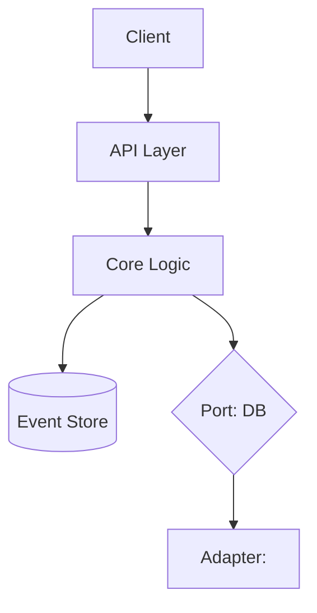

# ARCHITECTURE — <Project Name>

> Status: draft | current
> Last updated: YYYY-MM-DD
> Tier: small | medium | large

## High-level view

<One paragraph: what the system does, the main moving parts, and how they
fit together. Then a Mermaid component diagram.>



## Module boundaries

| Module | Responsibility | Inputs | Outputs | Boundaries (ports) |
|---|---|---|---|---|
| `core` | Pure business logic | Commands, events | New events, derived state | None — depends on ports |
| `api` | HTTP entry point | HTTP requests | HTTP responses | Calls `core` |
| `adapters/db` | Persistence | Commands from `core` | Persisted events | Implements `core.Port.EventStore` |
| `adapters/<vendor>` | External integration | … | … | Implements `core.Port.<Name>` |

## Contracts (the spine)

### Events

Every event carries a `version: int` field. Folding the event log yields
derived state. New event types are additive; renames/removals require a
migration ADR.

| Event | Fields | Idempotency key | Correlation/Causation (tier ≥ M) |
|---|---|---|---|
| `<EventName>` | `(version, occurred_at, …)` | `<field>` | `(correlation_id, causation_id)` |

### Data types

| Type | Fields | Validated at | Version field |
|---|---|---|---|
| `<TypeName>` | `…` | `<gate location>` | yes |

### Ports (interfaces in our code)

| Port | Operations | Production adapter | Test fake |
|---|---|---|---|
| `EventStore` | `append`, `fold`, `replay_from(offset)` | `<vendor>EventStore` | `InMemoryEventStore` |
| `<OtherPort>` | … | … | … |

## State model

State is derived by folding the event log. The fold function is in
`core/state.py` (or equivalent). The rebuild path:

```
# Small tier
$ <project>-rebuild < events.jsonl > derived_state.json

# Medium tier
$ <project>-rebuild --from <event_id> --to <event_id> --output projections/
```

Materialized projections (medium/large) refresh on a schedule defined in
`<config location>`.

## Non-functional targets

| Property | Target | Measured by |
|---|---|---|
| Request throughput | <rps> | <metric> |
| p95 latency | <ms> | <metric> |
| Durability | <copies/region> | <storage SLA> |
| Recovery time objective | <duration> | <rebuild plan> |
| Recovery point objective | <duration> | <event log SLA> |

## Observability

- **Logs**: structured (JSON), include `correlation_id` where present.
- **Metrics**: per-port operation, per-event-type append rate, fold lag.
- **Traces**: propagate `correlation_id` across port boundaries.
- **Alerts**: <list the SLOs that page>.

## Security & trust boundaries

- **Input validation**: at every external boundary (HTTP, queue, file).
- **Authz**: <where enforced; per-endpoint or per-aggregate>.
- **Secrets**: <where stored, rotation policy>.
- **PII**: <which events contain it; redaction policy>.

## Scaling transitions

When we cross:

- **10×**: <what changes — usually a metric to start watching>
- **100×**: <what changes — usually a plumbing tier shift>
- **1000×**: <what changes — usually re-architecture, new ADR>

## Decisions made

See `docs/ADR/` for the full list. Key load-bearing ADRs:

- ADR-0001: Initial architecture
- ADR-NNNN: <next>

## Out-of-scope

<What this architecture deliberately doesn't address. Critical for keeping
scope honest.>
